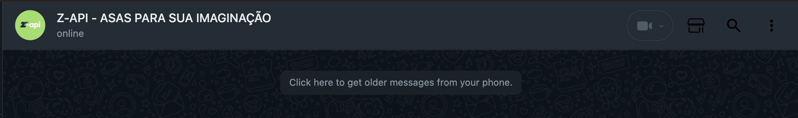

## Método

#### /chats/{phone}/request-older-messages

`POST` https://api.z-api.io/instances/SUA_INSTANCIA/token/SEU_TOKEN/chats/{phone}/request-older-messages

### Header

|      Key       |            Value            |
| :------------: |     :-----------------:     |
|  Client-Token  | **[TOKEN DE SEGURANÇA DA CONTA](../security/client-token)** |
---

## Conceituação

Este método permite recuperar mensagens anteriores de um chat que não foram carregadas inicialmente. Ele é útil para cenários em que o histórico completo do chat precisa ser acessado para fins de consulta, auditoria ou continuidade de conversas.

A API garante que mensagens anteriores sejam recuperadas de forma ordenada e consistente, respeitando os limites configurados e mantendo a integridade dos dados. Essa funcionalidade é especialmente valiosa em integrações que exigem contexto adicional para decisões ou respostas automatizadas.

Atenção! É importante destacar que esse endpoint é responsável apenas por **solicitar o recebimento** dessas mensanges. Se tudo ocorrer bem, as mensagens serão recebidas pelo mesmo webhook de dados inicias (initialData)



---

## Atributos

### Obrigatórios

| Atributos | Tipo | Descrição |
| :-- | :-: | :-- |
| oldestMessageId | string | Id da mensagem mais antiga que você possui. Pode ser obtido no webhook de dados inicias da conexão () |
| oldestMessageIsFromMe | string | Define se a mensagem mais antiga que você possui foi enviada pelo seu número conectado na instância ou não. Pode ser obtido no webhook de dados inicias da conexão () |
| oldestMessageTime | string | Timestamp da mensagem mais antiga que você possui. Pode ser obtido no webhook de dados inicias da conexão () |

---

## Request Body

Exemplo

```json
{
  "oldestMessageId": "3EB0AFABBFBF5F1C870F3F",
  "oldestMessageIsFromMe": true,
  "oldestMessageTime": 1730490576556
}
```

---

## Response

### 200

| Atributos | Tipo    | Descrição                       |
| :-------- | :------ | :------------------------------ |
| success   | boolean | Atributo de confirmação da ação (true, false) |

Exemplo

```json
{
  "success": true
}
```

### 405

Neste caso certifique que esteja enviando o corretamente a especificação do método, ou seja verifique se você enviou o POST ou GET conforme especificado no inicio deste tópico.

### 415

Caso você receba um erro 415, certifique de adicionar na headers da requisição o "Content-Type" do objeto que você está enviando, em sua grande maioria "application/json"

---

## Code

<iframe src="//api.apiembed.com/?source=https://raw.githubusercontent.com/Z-API/z-api-docs/main/json-examples/archive-chat.json&targets=all" frameborder="0" scrolling="no" width="100%" height="500px" seamless></iframe>
