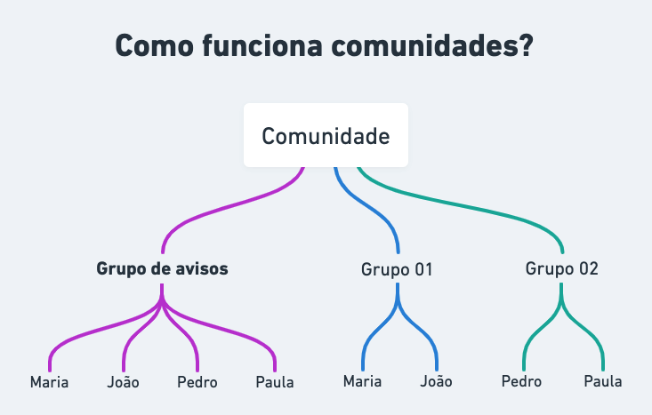

### Conceituação

O WhatsApp agora oferece a funcionalidade de Comunidades, que permite aos usuários agrupar grupos ao redor de um assunto ou interesse em comum. É uma maneira fácil de conectar com outras pessoas que compartilham dos mesmos objetivos e ideias.

Para exemplificar como funciona a estrutura de comunidades, veja a imagem abaixo:

**Observações:**

1. Ao criar uma comunidade, é criado um grupo padrão (grupo de avisos) com o mesmo nome da comunidade.
2. Este grupo representa sua comunidade inteira e é usado para enviar mensagens para todos.
3. Cada novo grupo vinculado a comunidade, todos participantes farão parte do grupo padrão (grupo de avisos).
4. Ao desvincular um grupo, todos participantes dele são removidos do grupo padrão (grupo de avisos).

Como pode ser visto acima, toda comunidade possui um **"Grupo de avisos"** neste grupo apenas administradores podem enviar mensagens, utilize ele sempre que quiser enviar algo para toda comunidade.

Cada comunidade pode ter até 50 grupos, e o(s) administrador(es) das comunidades poderão disparar mensagens para até 5 mil pessoas de uma única vez através do grupo de avisos.

### Perguntas sobre funcionamento das APIs

#### 1. Como faço para criar uma nova comunidades?

Primeiro é importante verificar se o aplicativo do whatsapp do seu celular já está compatível com as comunidades, caso não esteja, aguarde a atualização do aplicativo para sua conta, agora caso já tenha acesso a comunidades, veja a documentação de como <a href="/communities/create-community">criar comunidade via API.</a>

#### 2. Consigo listar as comunidades que faço parte?

Sim, o Z-API disponibiliza os métodos para que você consiga saber quais comunidades você faz parte, veja a documentação de como <a href="/communities/list-communities">listar suas comunidades.</a>

#### 3. Consigo vincular e desvincular grupos a uma comunidade?

Com certeza! o Z-API te entrega outras duas APIs para que você consiga gerenciar os grupos de uma comunidade, veja como <a href="/communities/link-groups">vincular grupos</a> ou <a href="/communities/unlink-groups">desvincular grupos</a> de uma comunidade.

#### 4. Como enviar mensagem para toda comunidade?

Como dito acima, a comunidade em si serve apenas para agrupar seus grupos e dar uma experiência e visão de todos os grupos da comunidade aos usuários. **Você pode sim enviar mensagem para toda comunidade**, más para isso é utilizado o **Grupo anúncios**. Como o grupo de avisos se trata de um grupo como qualquer outro, basta você possuir o **phone** do grupo e utilizar as APIs de envio de mensagem normalmente, assim como outros grupos comuns.

#### 5. Como consigo pegar os grupo de avisos?

Existem 3 formas de se pegar os grupos de anúncio.   - A primeira é na <a href="/communities/create-community">criação da comunidade</a>, que ao criar a comunidade já te retorna as informações do grupo de avisos.   - A segunda é pela API de <a href="/chats/get-chats">listar chats</a>, nela você pode diferenciar grupos normais de grupos de anúncios, o atributo **isGroup** estará como verdadeiro sempre que se tratar de um grupo normal e o atributo **isGroupAnnouncement** estará verdadeiro quando for um grupo de avisos.  - A terceira e última opcão é pela API de <a href="/communities/community-metadata">metadata da comunidade</a>, ela te retorna informações sobre a comunidade baseado no ID dela, retornando informações como nome da comunidade e seus grupos vinculados.

#### 6. Posso desativar uma comunidade?

Sim, você pode <a href="/communities/deactivate-community">desativar uma Comunidade</a> no WhatsApp, o que resultará na desconexão de todos os grupos relacionados a ela. É importante ressaltar que desativar a Comunidade não excluirá seus grupos, mas sim os removerá da Comunidade em questão.

#### 7. Como adicionar ou remover pessoas da comunidade?

Como comentado anteriormente, a comunidade em si é apenas o que agrupa seus grupos, o que de fato é utilizado são os grupos de anúncios, então caso queira gerar o link de convite, adicionar e remover pessoas, promover como administradoras etc... tudo será feito através do grupo de avisos utilizando as APIs que você já conhece.
