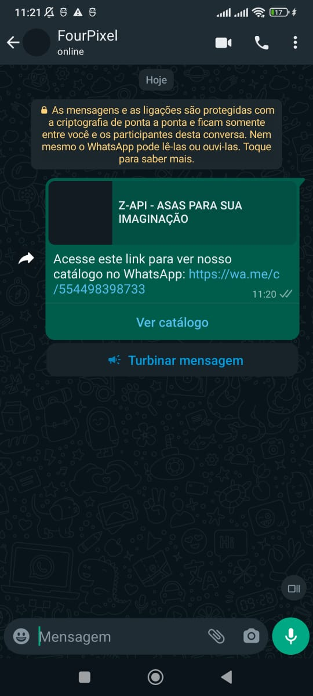

## Método

#### /send-catalog

`POST` https://api.z-api.io/instances/SUA_INSTANCIA/token/SEU_TOKEN/send-catalog

### Header

|      Key       |            Value            |
| :------------: |     :-----------------:     |
|  Client-Token  | **[TOKEN DE SEGURANÇA DA CONTA](../security/client-token)** |
---

## Conceituação

Neste método você poderá enviar mensagens com o link para o seu catálogo. O recurso de catálogos está disponível apenas para contas **business** do WhatsApp. É necessário também, que a conta possua produtos e um catálogo configurado. Operações realacionadas a produtos e coleções podem ser encontradas na sessão **[Whatsapp Business](../business/edit-product.md)** da nossa documentação.



---

## Atributos

### Obrigatórios

| Atributos | Tipo   | Descrição |
| :------   | :----: | :------   |
| phone     | string | Telefone (ou ID do grupo para casos de envio para grupos) do destinatário no formato DDI DDD NÚMERO Ex: 551199999999. **IMPORTANTE** Envie somente números, sem formatação ou máscara |
| catalogPhone   | string | Telefone da conta business a qual pertence o catálogo. |

---

## Request Body

```json
{
  "phone": "5511999999999",
  "catalogPhone": "5511999999999"
}
```

## Response

### 200

| Atributos | Tipo   | Descrição      |
| :-------- | :----- | :------------- |
| zaapId    | string | id no z-api    |
| messageId | string | id no whatsapp |
| id        | string | Adicionado para compatibilidade com zapier, ele tem o mesmo valor do messageId |


Exemplo

```json
{
  "zaapId": "3999984263738042930CD6ECDE9VDWSA",
  "messageId": "D241XXXX732339502B68",
  "id": "D241XXXX732339502B68"
}
```

### 405

Neste caso certifique que esteja enviando o corretamente a especificação do método, ou seja verifique se você enviou o POST ou GET conforme especificado no inicio deste tópico.

### 415

Caso você receba um erro 415, certifique de adicionar na headers da requisição o "Content-Type" do objeto que você está enviando, em sua grande maioria "application/json"

---

## Webhook Response

Link para a response do webhook (ao receber)

[Webhook](../webhooks/on-message-received#exemplo-de-retorno-de-texto)

---

## Code

<iframe src="//api.apiembed.com/?source=https://raw.githubusercontent.com/Z-API/z-api-docs/main/json-examples/send-catalog.json&targets=all" frameborder="0" scrolling="no" width="100%" height="500px" seamless></iframe>
