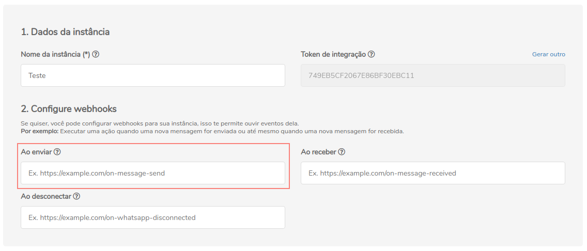

## Método on-message-send

## Conceituação

Esse é o webhook de retorno de mensagens enviadas

:::caution Atenção

O Z-API não aceita webhooks que não sejam HTTPS

:::

---



---

## Atributos

### Obrigatórios

| Atributos | Tipo | Descrição |
| :-- | :-: | :-- |
| phone | string | Número de telefone de destino da mensagem. |
| zaapId | string | Identificador da mensagem na conversa. |
| type | string | Tipo do evento da instância, nesse caso será "DeliveryCallback". |

### Opcionais

| Atributos | Tipo | Descrição |
| :-- | :-: | :-- |
| customId | string | Identificador provido pelo usuário para controle de mensagem utilizando seus próprios IDs. |

---

## Response

### 200

```json
{
  "phone": "554499999999",
  "customId": "123",
  "zaapId": "A20DA9C0183A2D35A260F53F5D2B9244",
  "messageId": "A20DA9C0183A2D35A260F53F5D2B9244",
  "type": "DeliveryCallback"
}
```

### 405

Neste caso certifique que esteja enviando o corretamente a especificação do método, ou seja verifique se você enviou o POST ou GET conforme especificado no inicio deste tópico.

### 415

Caso você receba um erro 415, certifique de adicionar na headers da requisição o "Content-Type" do objeto que você está enviando, em sua grande maioria "application/json"

---

## Code

<iframe src="//api.apiembed.com/?source=https://raw.githubusercontent.com/Z-API/z-api-docs/main/json-examples/on-message-send.json&targets=all" frameborder="0" scrolling="no" width="100%" height="500px" seamless></iframe>
