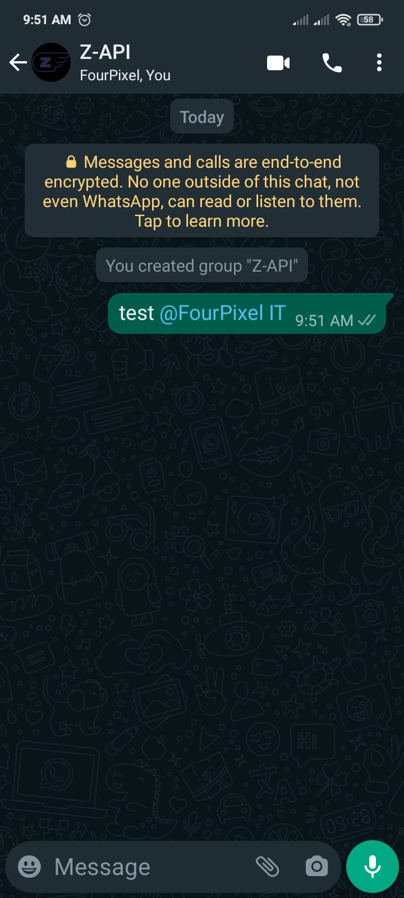

## Method

#### /send-text

`POST` https://api.z-api.io/instances/SUA_INSTANCIA/token/SEU_TOKEN/send-text

---

## Concept

This method is responsible for mentioning participants in a group.



---

## Attributes

### Required

| Attributes | Type  | Description |
| :--       | :-:    | :-------  |
| phone     | string | The group ID where the participants will be mentioned. |
| message   | string | Text to be sent. It should include the @ symbol with the number. |
| mentioned | array  | Numbers to be mentioned. |

### Opcionais

| Atributos | Tipo | Descrição |
| :-- | :-: | :-- |
| delayMessage | number | In this attribute a delay is added to the message. You can decide between a range of 1 - 15 secs (this is for how many seconds it will wait to send the next message EX: “delayMessage”:5,). The default delay is between 1 - 3 secs. |

---

## Request Body

```json
{
  "phone": "5511999999999",
  "message": "Welcome to *Z-API group* @number",
  "mentioned": [number]
}
```

---

## Marcar todos no grupo

This method allows you to mention multiple members of a WhatsApp group without the need to explicitly include the '@' before the numbers. This is useful for tagging multiple members at once.

```json
{
  "phone": "5511999999999-group",
  "message": "Welcome to *Z-API group*",
  "mentioned": [number,number,number,number,number,number]
}
```
---

## Response

### 200

| Atributos | Tipo   | Descrição      |
| :-------- | :----- | :------------- |
| zaapId    | string | id on z-api    |
| messageId | string | id on whatsapp |
| id | string | Added for compatibility with Zapier, it has the same value as the messageId.|

Exemplo

```json
{
  "zaapId": "3999984263738042930CD6ECDE9VDWSA",
  "messageId": "D241XXXX732339502B68",
  "id": "D241XXXX732339502B68"
}
```

### 405

In this case certify that you are sending the correct specification of the method. This means, verify if you sent a POST or GET as specified at the beginning of this topic.

### 415

In case you receive 415 error, make sure to add the “Content-Type” of the object you are sending in the request headers, mostly “application/json”

---

## Webhook Response

Link to webhook response (on receipt)

[Webhook](../webhooks/on-message-received#response)

---

## Code

<iframe src="//api.apiembed.com/?source=https://raw.githubusercontent.com/Z-API/z-api-docs/main/json-examples/send-text.json&targets=all" frameborder="0" scrolling="no" width="100%" height="500px" seamless></iframe>
