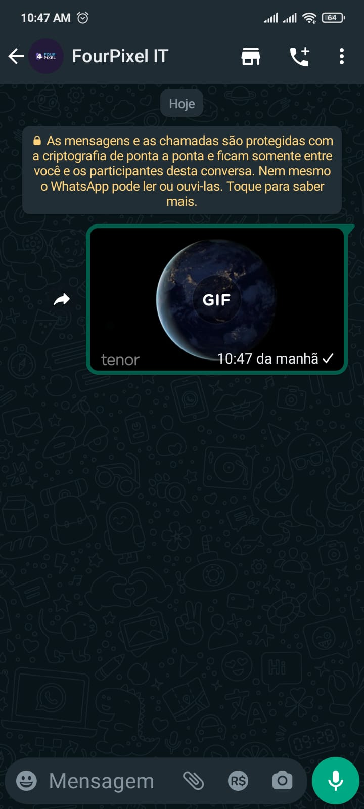

## Method

#### /send-gif

`POST` https://api.z-api.io/instances/YOUR_INSTANCE/token/YOUR_TOKEN/send-gif

### Header

|      Key       |            Value            |
| :------------: |     :-----------------:     |
|  Client-Token  | **[ACCOUNT SECURITY TOKEN](../security/client-token)** |

---

## Concept

Method responsible for sending GIFs to your chats through the API (The file to be sent must be an MP4).

### Size and formats

WhatsApp limits the size of files, and its policy changes constantly. Therefore, we always recommend checking directly on WhatsApp's website for the most up-to-date information.

In this [link], you will find everything you need to know about file formats and sizes.

[link]: https://developers.facebook.com/docs/whatsapp/api/media



---

## Attributes

### Required

| Attributes   | Type   | Description |
| :-------     | :-:    | :-------    |
| phone        | string | Recipient (or group ID in case you want to send it to a group) telephone number in the format DDI DDD NUMERS Ex: 551199999999. IMPORTANT  only send numbers without formatting or a mask |
| gif          | string | Link to your GIF file (The file must be an mp4)|

### Optional

| Attributes   | Type   | Description |
| :-- | :-: | :-- |
| messageId | String | Attribute used to reply to a message in the chat. Simply add the messageId of the message you want to reply to in this attribute |
| delayMessage | number | In this attribute a delay is added to the message. You can decide between a range of 1 - 15 secs (this is for how many seconds it will wait to send the next message EX: “delayMessage”:5,). The default delay is between 1 - 3 secs |
---

## Request Body

```json
{
  "phone": "",
  "gif": "https://file-examples.com/storage/fe88505b6162b2538a045ce/2017/04/file_example_MP4_480_1_5MG.mp4"
}
```

---

## Response

### 200

| Attributes| Type   | Description    |
| :-------- | :----- | :------------- |
| zaapId    | string | id on z-api    |
| messageId | string | id on whatsapp |
| id        | string | Added for compatibility with Zapier, it has the same value as the messageId |

Example

```json
{
  "zaapId": "3999984263738042930CD6ECDE9VDWSA",
  "messageId": "D241XXXX732339502B68",
  "id": "D241XXXX732339502B68"
}
```

### 405

In this case certify that you are sending the correct specification of the method. This means, verify if you sent a POST or GET as specified at the beginning of this topic.

### 415

In case you receive 415 error, make sure to add the “Content-Type” of the object you are sending in the request headers, mostly “application/json”

---

## Webhook Response

Link for webhooks response (upon receiving)

[Webhook](../webhooks/on-message-received#exemplo-de-retorno-de-gif)

---

## Code

<iframe src="//api.apiembed.com/?source=https://raw.githubusercontent.com/Z-API/z-api-docs/main/json-examples/send-gif.json&targets=all" frameborder="0" scrolling="no" width="100%" height="500px" seamless></iframe>
