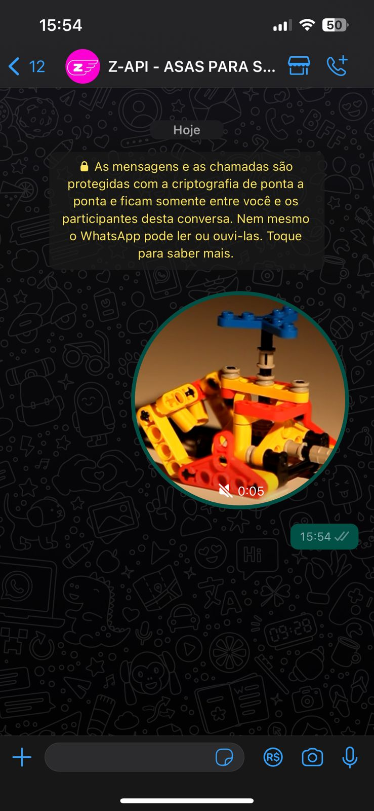

## Method

#### /send-ptv

`POST` https://api.z-api.io/instances/YOUR_INSTANCE/token/YOUR_TOKEN/send-ptv

### Header

|      Key       |            Value            |
| :------------: |     :-----------------:     |
|  Client-Token  | **[ACCOUNT SECURITY TOKEN](../security/client-token)** |

---

## Concept

Method responsible for sending PTV to your chats. You can work with PTV in 2 ways:

By Link: Where you have a video hosted somewhere on the internet and send only the link to it.

By Base64: If you choose this option, you will need to have a method in your application to convert the video to Base64.

### Size and formats

WhatsApp limits the size of files, and its policy changes constantly. Therefore, we always recommend checking directly on WhatsApp's website for the most up-to-date information.

In this [link], you will find everything you need to know about file formats and sizes.

[link]: https://developers.facebook.com/docs/whatsapp/api/media


---

## Atributos

### Required

| Attributes   | Type   | Description |
| :-------     | :--:   | :------     |
| phone        | string | Recipient (or group ID in case you want to send it to a group) telephone number in the format DDI DDD NUMERS Ex: 551199999999. IMPORTANT  only send numbers without formatting or a mask |
| video        | string | Link to the video or its Base64|

### Optional

| Attributes   | Type   | Description |
| :-------     | :--:   | :------     |
| messageId | String | Attribute used to reply to a message in the chat. Simply add the messageId of the message you want to reply to in this attribute |
| delayMessage | number | In this attribute a delay is added to the message. You can decide between a range of 1 - 15 secs (this is for how many seconds it will wait to send the next message EX: “delayMessage”:5,). The default delay is between 1 - 3 secs |

---

## Request Body

##### Send via URL
```json
{
  "phone": "5511999999999",
  "ptv": "http://techslides.com/demos/sample-videos/small.mp4"
}
```

##### Send via Base64
```json
{
  "phone": "5544999999999",
  "ptv": "data:video/mp4;base64,AAYXJ0eHJlZgIGZ0eXBtc0eHDQyAAg3NDINCiUlRUAAAG1wNDJtcD"
}
```

---

## Response

### 200

| Atributos | Tipo   | Descrição      |
| :-------- | :----- | :------------- |
| zaapId    | string | id on z-api    |
| messageId | string | id on whatsapp |
| id        | string | Added for compatibility with Zapier, it has the same value as the messageId |

Example

```json
{
  "zaapId": "3999984263738042930CD6ECDE9VDWSA",
  "messageId": "D241XXXX732339502B68",
  "id": "D241XXXX732339502B68"
}
```

### 405

In this case certify that you are sending the correct specification of the method. This means, verify if you sent a POST or GET as specified at the beginning of this topic.

### 415

In case you receive 415 error, make sure to add the “Content-Type” of the object you are sending in the request headers, mostly “application/json”

---

## Webhook Response

Link for webhooks response (upon receiving)

[Webhook](../webhooks/on-message-received#exemplo-de-retorno-de-ptv)

---

## Code

<iframe src="//api.apiembed.com/?source=https://raw.githubusercontent.com/Z-API/z-api-docs/main/json-examples/send-ptv.json&targets=all" frameborder="0" scrolling="no" width="100%" height="500px" seamless></iframe>
