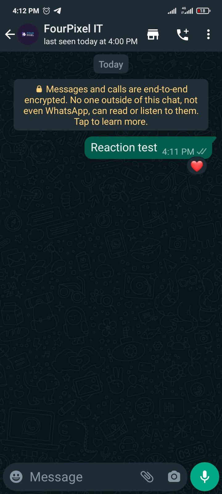

## Method 

#### /send-reaction

`POST` https://api.z-api.io/instances/SUA_INSTANCIA/token/SEU_TOKEN/send-reaction

---

## Concept 

In this method you will be able to react to messages that were sent or recieved by you. All you need to inform is the number in the chat, an emoji and the message which you will react to! 




---

## Attributes

[link]: https://fsymbols.com/pt/emoji/

### mandatory

| Attributes | Type | Description |
| :-- | :-: | :-- |
| phone | string | Recipient (or group ID in case you want to send it to a group) telephone number in the format DDI DDD NUMERS Ex: 551199999999. **IMPORTANT**  only send numbers without formatting or a mask  |
| reaction | string | Reaction emoji(Here are the options) [link] |
| messageId | string | message Id that will recieve the reaction |

### Optionals 

| Attributes | Type | Description |
| :-- | :-: | :-- |
| delayMessage | number | In this attribute a delay is added to the message. You can decide between a range of 1 - 15 secs (this is for how many seconds it will wait to send the next message EX: “delayMessage”:5,). The default delay is between 1 - 3 secs. |

---

## Request Body

```json
{
  "phone": "PHONE DO CHAT",
  "reaction": "❤️",
  "messageId": "menssage that will be reacted to"
}
```

---

## Response

### 200

| Attributes | Type   | Description      |
| :-------- | :----- | :------------- |
| zaapId    | string | id on z-api    |
| messageId | string | id on whatsapp |

Example 

```json
{
  "zaapId": "3999984263738042930CD6ECDE9VDWSA",
  "messageId": "D241XXXX732339502B68"
}
```

### 405

In this case certify that you are sending the correct specification of the method. This means, verify if you sent a POST or GET as specified at the beginning of this topic.
### 415

In case you receive 415 error, make sure to add the “Content-Type” of the object you are sending in the request headers, mostly “application/json”

---

## Webhook Response

Link for webhooks response (upon receiving)

[Webhook](../webhooks/on-message-received#exemplo-de-retorno-de-reação)

---

## Code

<iframe src="//api.apiembed.com/?source=https://raw.githubusercontent.com/Z-API/z-api-docs/main/json-examples/send-reaction.json&targets=all" frameborder="0" scrolling="no" width="100%" height="500px" seamless></iframe>
