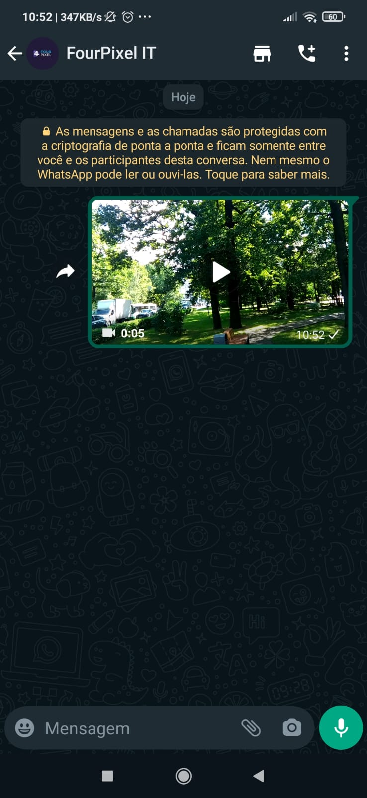

## Method

#### /send-video

`POST` https://api.z-api.io/instances/SUA_INSTANCIA/token/SEU_TOKEN/send-video

---

## Concept

Method responsible for sending videos to your chats, you can work with two types of videos which are: 

 - By link, where you have a video hosted somewhere on the internet and it sends the audio’s link 

 - By Base64. If you have opted for this option you will need to have a method on your website to convert the video to Base64.

### Size and formats 

WhatsApp limits the sizes of files and its politics constantly changes and because of that we always recommend that you verify directly on WhatsApp’s website.

In this [link] you can find everything that you need to know about formatting and file sizing.
[link]: https://developers.facebook.com/docs/whatsapp/api/media



---

## Attributes

### mandatory 

| Attributes | Type | Description |
| :-- | :-: | :-- |
| phone | string | Recipient (or group ID in case you want to send it to a group) telephone number in the format DDI DDD NUMERS Ex: 551199999999. IMPORTANT  only send numbers without formatting or a mask  |
| video | string | video’s link or its Base64|

### Opcionais

| Attributes | Type | Description |
| :-- | :-: | :-- |
| messageId | String | Attribute used to answer a chat message. All you have to do is add the messageID of the message that you want to respond to this attribute |
| delayMessage | number | In this attribute a delay is added to the message. You can decide between a range of 1 - 15 secs (this is for how many seconds it will wait to send the next message EX: “delayMessage”:5,). The default delay is between 1 - 3 secs. |
| caption | String | Message that you wish to send along with the video|


---

## Request Body

```json
{
  "phone": "5511999999999",
  "video": "https://file-examples-com.github.io/uploads/2017/04/file_example_MP4_480_1_5MG.mp4",
  "caption": "Test"
}
```

---

## Response

### 200

| Attributes | Type   | Description      |
| :-------- | :----- | :------------- |
| zaapId    | string | id on z-api    |
| messageId | string | id on whatsapp |

Example

```json
{
  "zaapId": "3999984263738042930CD6ECDE9VDWSA",
  "messageId": "D241XXXX732339502B68"
}
```

### 405

In this case certify that you are sending the correct specification of the method. This means, verify if you sent a POST or GET as specified at the beginning of this topic.

### 415

In case you receive 415 error, make sure to add the “Content-Type” of the object you are sending in the request headers, mostly “application/json”

---

## Webhook Response

Link for webhooks response (upon receiving)

[Webhook](../webhooks/on-message-received#exemplo-de-retorno-de-vídeo)

---

## Code

<iframe src="//api.apiembed.com/?source=https://raw.githubusercontent.com/Z-API/z-api-docs/main/json-examples/send-video.json&targets=all" frameborder="0" scrolling="no" width="100%" height="500px" seamless></iframe>
