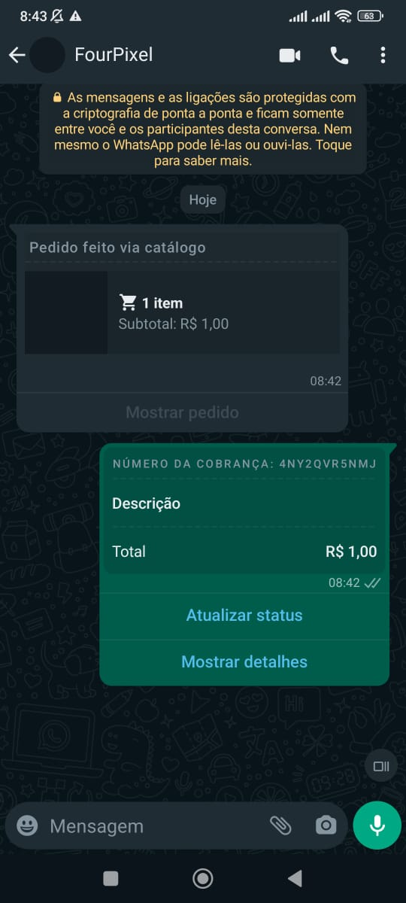

## Method

#### /send-order

`POST` https://api.z-api.io/instances/YOUR_INSTANCE/token/YOUR_TOKEN/send-order

### Header

|      Key       |            Value            |
| :------------: |     :-----------------:     |
|  Client-Token  | **[ACCOUNT SECURITY TOKEN](../security/client-token)** |
---

## Concept

With this method, you can send order messages containing products from your catalog or custom products created at the time of sending. Remembering that this message is the same one that is sent when you click on the "Accept order" - or "Send billing" - button on the customer's order. Such a message returns in the **[webhook](../webhooks/on-message-received#send-order-return-example)** information about the order as well as the data required for **[status updates](./update-order-status.md)** and **[payment](./update-order-payment.md)**, which in turn, are also messages, which reference the main message of the order, that is, the message sent from this route.



---

:::important Important
This method is available only for WhatsApp Business accounts.
:::

---

## Attributes

### Required

| Attribute | Type   | Description |
| :------   | :----: | :------   |
| phone     | string | Recipient's phone number in the format DDI DDD NUMBER, e.g., 551199999999. **IMPORTANT**: Send only numbers, without formatting or masks. |
| order     | object | Information about the order to be sent |

Object (order)

| Attribute | Type         | Description       |
| :------   | :----------: | :-------------  |
| currency  | string       | Currency code |
| products  | array object | Information about products related to the order |

Object (products)

| Attribute | Type         | Description        |
| :------   | :----------: | :-------------   |
| name      | string       | Product name  |
| value     | number       | Product value |
| quantity  | number       | Quantity       |

### Optional

Object (order)

| Attribute | Type         | Description         |
| :------   | :----------: | :---------------  |
| discount  | number       | Discount amount |
| tax       | number       | Tax amount  |
| shipping  | number       | Shipping cost    |

Object (products)

| Attribute | Type         | Description                    |
| :------   | :----------: | :--------------------------- |
| productId | string       | Catalog product ID    |

---

## Request Body

### Including optional parameters

```json
{
    "phone": "554499999999",
    "order": {
        "currency": "BRL",
        "discount": 10,
        "tax": 10,
        "shipping": 5,
        "products": [
            {
                "productId": "23940797548900636",
                "name": "Product Name",
                "value": 10,
                "quantity": 2
            }
        ]
    }
}
```

### Only required parameters

```json
{
    "phone": "554499999999",
    "order": {
        "currency": "BRL",
        "products": [
            {
                "name": "Product Name",
                "value": 150,
                "quantity": 1
            }
        ]
    }
}
```

:::tip Tip
When sending a product in the "products" list without the "productId" attribute, it is considered a "custom product." It receives an ID to be used in the context of this order, which is returned in the webhook of **[ReceivedCallback](../webhooks/on-message-received#send-order-return-example)** and should be used for order status updates.
:::

## Response

### 200

| Attribute | Type   | Description      |
| :-------- | :----- | :------------- |
| zaapId    | string | z-api ID    |
| messageId | string | WhatsApp ID |
| id        | string | Added for compatibility with Zapier; it has the same value as messageId |

Example

```json
{
  "zaapId": "3999984263738042930CD6ECDE9VDWSA",
  "messageId": "D241XXXX732339502B68",
  "id": "D241XXXX732339502B68"
}
```

### 405

In this case, ensure that you are correctly following the method specification, i.e., check if you sent the POST or GET as specified at the beginning of this topic.

### 415

If you receive a 415 error, make sure to add the "Content-Type" of the object you are sending to the request headers, which is usually "application/json."

---

## Webhook Response

Link to the webhook response (upon receiving)

[Webhook](../webhooks/on-message-received#send-order-return-example)

---

## Code

<iframe src="//api.apiembed.com/?source=https://raw.githubusercontent.com/Z-API/z-api-docs/main/json-examples/send-order.json&targets=all" frameborder="0" scrolling="no" width="100%" height="500px" seamless></iframe>
