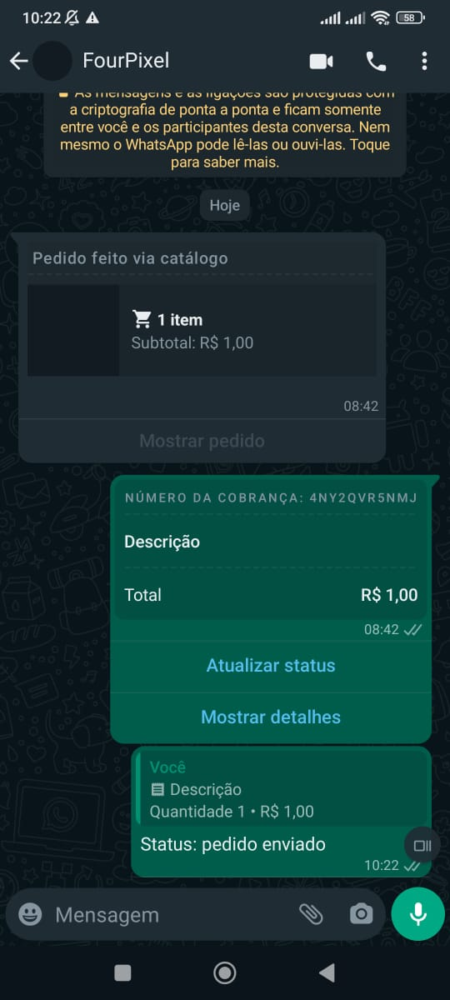

## Method

#### /order-status-update

`POST` https://api.z-api.io/instances/YOUR_INSTANCE/token/YOUR_TOKEN/order-status-update

### Header

|      Key       |            Value            |
| :------------: |     :-----------------:     |
|  Client-Token  | **[ACCOUNT SECURITY TOKEN](../security/client-token)** |
---

## Concept

With this method, you can send messages to update the status of previously sent orders.



---

:::important Important
This method is available only for WhatsApp Business accounts.
:::

---

## Attributes

### Required

| Attributes       | Type   | Description |
| :-------------- | :----: | :-------- |
| phone           | string | Recipient's phone number in the format DDI DDD NUMBER, e.g., 551199999999. **IMPORTANT**: Send only numbers, without formatting or masks |
| messageId       | string | ID of the original WhatsApp message of the order |
| referenceId     | string | Reference ID of the order (returned in the **[webhook](../webhooks/on-message-received#send-order-return-example)**) |
| orderRequestId  | string | Order request reference ID (returned in the **[webhook](../webhooks/on-message-received#send-order-return-example)**) |
| orderStatus     | string | New order status (pending, processing, shipped, completed, canceled) |
| paymentStatus   | string | Current payment status (pending, paid) (returned in the **[webhook](../webhooks/on-message-received#send-order-return-example)**) |
| order           | object | Information about the order to be sent |

Object (order)

| Attributes | Type         | Description       |
| :------   | :----------: | :-------------  |
| currency  | string       | Currency code |
| products  | array object | Information about products related to the order |

Object (products)

| Attributes     | Type         | Description                 |
| :------------ | :----------: | :------------------------  |
| productId     | string       | Product ID (returned in the **[webhook](../webhooks/on-message-received#send-order-return-example)**) |
| name          | string       | Product name           |
| value         | number       | Product value          |
| quantity      | number       | Quantity                |
| isCustomItem  | boolean      | Indicates if it's a custom product at the time of sending (returned in the **[webhook](../webhooks/on-message-received#send-order-return-example)**) |

### Optional

| Atributos | Tipo         | Descrição         |
| :------   | :----------: | :---------------  |
| message   | string       | Text message      |

Object (order)

| Attributes | Type         | Description         |
| :------   | :----------: | :---------------  |
| discount  | number       | Discount amount |
| tax       | number       | Tax amount  |
| shipping  | number       | Shipping cost    |

---

## Request Body

:::caution Caution
In the request, you must include all the data previously provided when sending the order, with the addition of some mandatory additional parameters, which are returned in the **[webhook](../webhooks/on-message-received#send-order-return-example)**
:::

```json
{
    "phone": "554499999999",
    "messageId": "3EB0F91BBA791BB0A787FC",
    "message": "Order update text message",
    "referenceId": "4N8FCTW1WM6",
    "orderRequestId": "4N8FCTW22W4",
    "orderStatus": "processing",
    "paymentStatus": "pending",
    "order": {
        "currency": "BRL",
        "discount": 10,
        "tax": 10,
        "shipping": 5,
        "products": [
            {
                "value": 150,
                "quantity": 2,
                "name": "order 1",
                "isCustomItem": true,
                "productId": "custom-item-4N8FCTW23N7"
            },
            {
                "productId": "23940797548900636",
                "value": 150,
                "quantity": 2,
                "name": "order 2",
                "isCustomItem": false
            }
        ]
    }
}
```

:::tip Tip
You can notice that the product with the "isCustomItem" attribute set to true has an ID with the "custom-item" prefix. This occurs when no product ID is provided when sending an order, meaning WhatsApp assumes it's a custom product. This ID is returned in the **[webhook](../webhooks/on-message-received#send-order-return-example)** and is a mandatory parameter, along with "isCustomItem," for order updates.
:::

## Response

### 200

| Attributes | Type   | Description      |
| :-------- | :----- | :------------- |
| zaapId    | string | z-api ID    |
| messageId | string | WhatsApp ID |
| id        | string | Added for compatibility with Zapier; it has the same value as messageId |

Example

```json
{
  "zaapId": "3999984263738042930CD6ECDE9VDWSA",
  "messageId": "D241XXXX732339502B68",
  "id": "D241XXXX732339502B68"
}
```

### 405

In this case, ensure that you are correctly following the method specification, i.e., check if you sent the POST or GET as specified at the beginning of this topic.

### 415

If you receive a 415 error, make sure to add the "Content-Type" of the object you are sending to the request headers, which is usually "application/json."

---

## Webhook Response

Link to the webhook response (upon receiving)

[Webhook](../webhooks/on-message-received#update-order-return-example)

---

## Code

<iframe src="//api.apiembed.com/?source=https://raw.githubusercontent.com/Z-API/z-api-docs/main/json-examples/send-order-status-update.json&targets=all" frameborder="0" scrolling="no" width="100%" height="500px" seamless></iframe>
